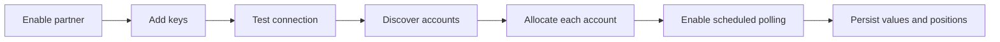
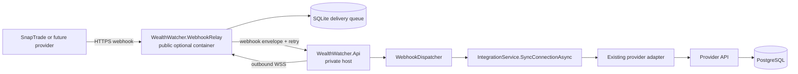
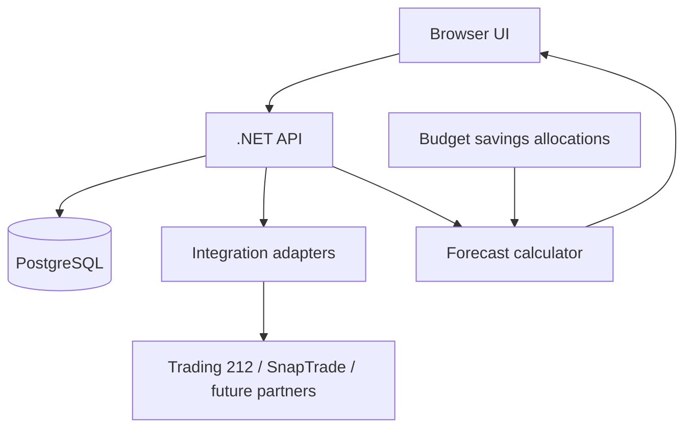

# Wealth Watcher architecture

Wealth Watcher is a local-first .NET API with a browser UI. PostgreSQL is used for the deployed runtime and an in-memory database is used by the development/test harness.

The current security boundary is one trusted deployment: the API has no built-in user authentication, authorization, or tenant isolation. Docker binds services to loopback by default, and deployments that need broader access must add an external trust boundary and configure the allowed UI origins deliberately. Public Internet exposure remains unsupported until the authentication and authorization requirements in `OPEN_SOURCE_READINESS.md` are complete.

## Integrations

External partners implement the application-owned `IIntegrationAdapter` contract. The contract separates partner concerns from persistence and exposes three operations:

1. Test credentials.
2. Discover external accounts.
3. Pull account values and optional position details.

Connections, discovered accounts, asset allocations, polling schedules, and sync status are stored in the database. Polling supports a fixed minute interval, five-field cron, hourly minute offsets, hourly on-the-hour, daily, and weekly wall-clock schedules. The UI enables an integration through the following lifecycle:

Credentials are protected with ASP.NET Core Data Protection before they are written to the database. The local key ring is persisted under the configured application data path so encrypted credentials remain usable after a restart. API responses expose only whether credentials exist, never the stored secret.

The older `WealthEntry` and provider-column properties remain as a migration compatibility surface for existing data and tests. New code should use `AssetValueEntry`, `AssetValueEntrySource`, and the normalized integration entities; the compiler warnings are intentionally retained until the compatibility surface can be removed safely.

Trading 212 supports live/demo environments and an optional portfolio X-Ray position pull. The X-Ray option is off by default and can be enabled per connection.

## Optional webhook relay

The webhook relay is a separate ASP.NET Core project and published container. It is not part of the default private `db + api + web` Compose stack and no relay container is required on the Wealth Watcher host.

The private API always initiates the WebSocket connection. The relay authenticates that connection with a private pairing id and token, accepts only provider-specific requests that pass the configured validator, and queues an intentionally generic envelope. Acknowledgements are sent only after processing succeeds or an event is safely ignored. If the API is offline or synchronization fails transiently, the SQLite queue retries the event. The API's optional relay switch is persisted in `AppPreferences`; it can pause and resume the live relay connection without changing deployment secrets. The Integrations screen can also send a diagnostic event through the relay queue and require an API acknowledgement. A relay host is paired with one self-hosted Wealth Watcher deployment; the pairing id is internal and is not included in provider webhook URLs.

Webhook events are triggers rather than a second source of truth: `WebhookDispatcher` resolves a configured connection and calls the same `SyncConnectionAsync` path used by explicit and scheduled syncs. Each connection selects exactly one automatic update mode, `Polling` or `Webhook`; the scheduled worker only considers polling-mode connections and evaluates their schedule using the API host's local time, while the dispatcher only considers webhook-mode connections. Explicit manual sync remains available. Provider capability metadata is exposed through `IntegrationDescriptor.SupportsWebhooks`; SnapTrade is currently the only adapter marked as supporting it.

The relay's provider handler boundary keeps signature and payload rules out of the generic delivery code. The initial SnapTrade handler validates the `Signature` HMAC using the configured consumer key, applies a short event timestamp window, and forwards only the signature header rather than arbitrary request headers. Provider-facing routes use `/webhooks/{provider}`; the relay host, rather than a path segment, identifies the deployment. The relay must be deployed behind HTTPS/WSS in production; it does not make the private API publicly reachable.

## Forecast and budgeting

Budget savings entries have a monthly, quarterly, or annual cadence and may be allocated to an existing asset or left unallocated. Allocated savings are added to that asset's forecast stream and compounded using its selected projection rate; unallocated savings remain in the forecast's contributions stack.

## Data flow

## Canonical database vocabulary

The normalized schema is documented in [DatabaseSchemaDefinitions.html](DatabaseSchemaDefinitions.html). The central identity is `Asset`; its type and grouping are represented by `AssetKindAssignments` and `AssetKindGroups`. Historical observations are `AssetValueEntries`, and integration provenance is represented by `AssetValueEntrySources` rather than text provider columns on the fact row.

All persisted table names are plural. Integration providers, connections, accounts, external values, and their allocation joins are separate records. The one-time legacy backfill is documented in `WealthWatcher.Api/Database/20260806_schema_refactor.sql`; new relational databases use the generated EF migration in `WealthWatcher.Api/Migrations`.
